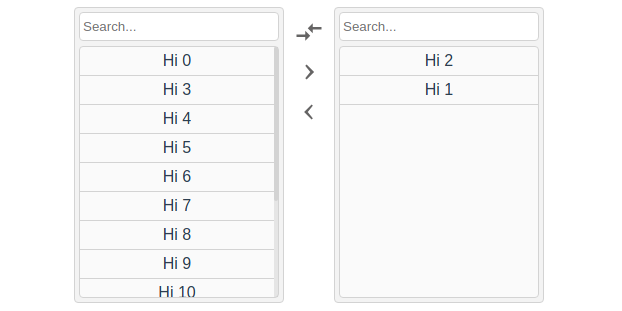

# V-Multi-select
Simple Multi-Select in Vue

[


](https://www.npmjs.com/package/v-multi-select.svg)
[](https://vuejs.org/)



## Table of contents
- [Installation](#installation)
- [Usage](#usage)
- [Demo](#demo)

# Installation
```bash
yarn add v-multi-select
```
# Usage
```vue
<template>
  <div id="app">
    <VDoubleSelect
      ref="DoubleSelect"
      :left="arrayExample"
      :right="arrayEmpty"
      @change="showData"
      @select="showSelected"
    />
  </div>
</template>

<script>
import VDoubleSelect from 'v-multi-select';

export default {
  name: 'app',
  components: {
    VDoubleSelect
  },
  data: () => ({
    arrayExample: [],
    arrayEmpty: []
  }),
  mounted() {
    for (let index = 0; index < 16; index++) {
      this.arrayExample.push(`Hi ${index}`);
    }
  },
  methods: {
    showData(data) {
      console.group('New Change:', data);
    },
    getDataLeft() {
      console.log(this.$refs.DoubleSelect.dataLeft);
    },
    getDataRight() {
      console.log(this.$refs.DoubleSelect.dataRight);
    },
    showSelected(data) {
      console.log(`New Selected: ${data}`);
    }
  }
};
</script>
```

Or use a single data source:
```html
    <VDoubleSelect
      :left="arrayExample"
      @change="showData"
    />
```

# Demo
<!-- Click here to view in Browser: [Vue Component (Multi Select/Double Select)]() -->
